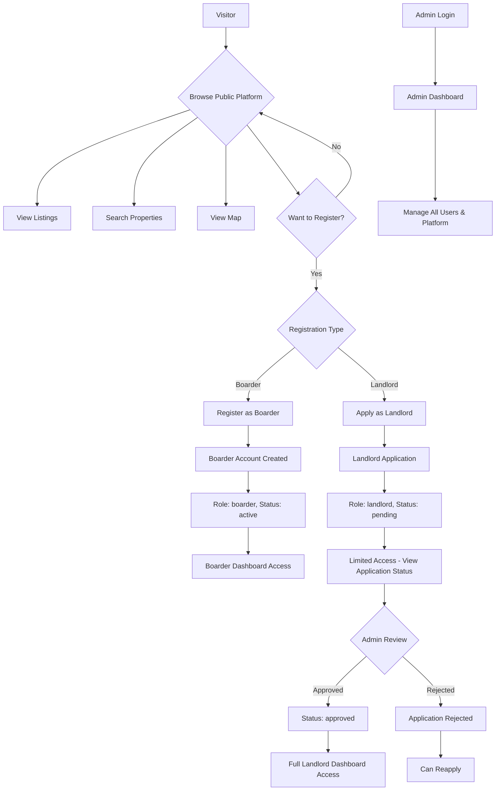
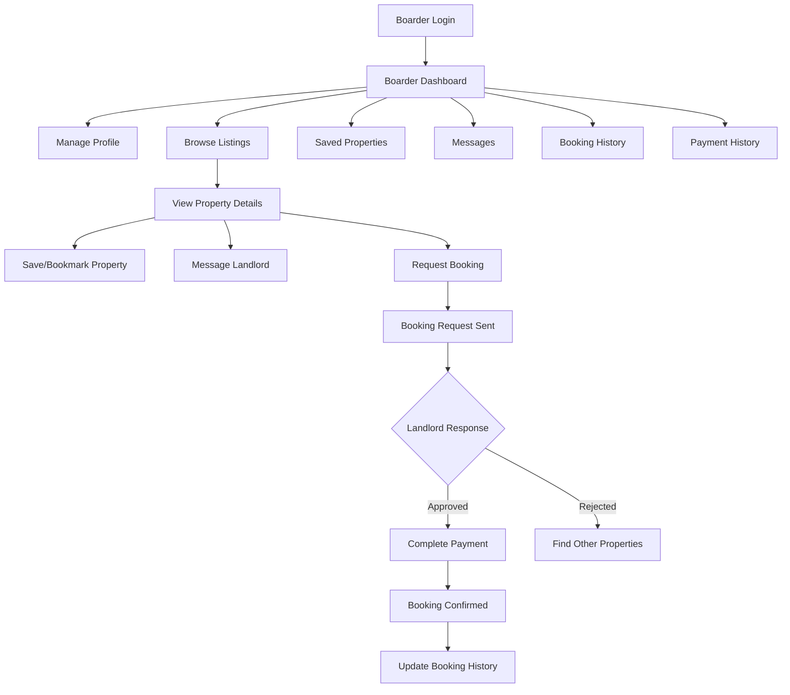
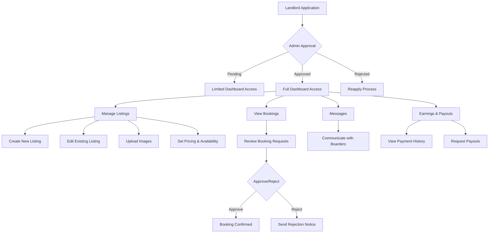
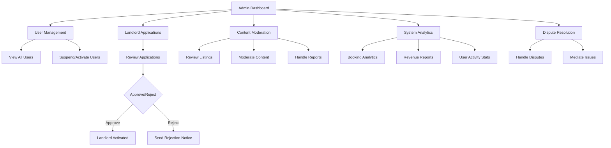
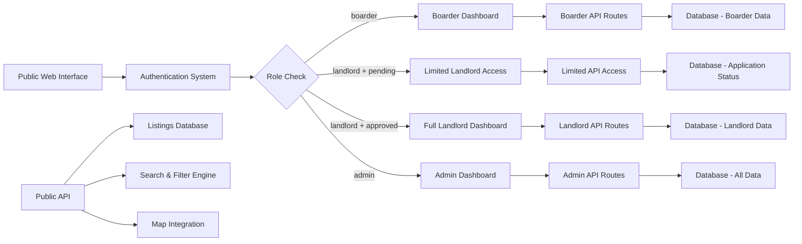
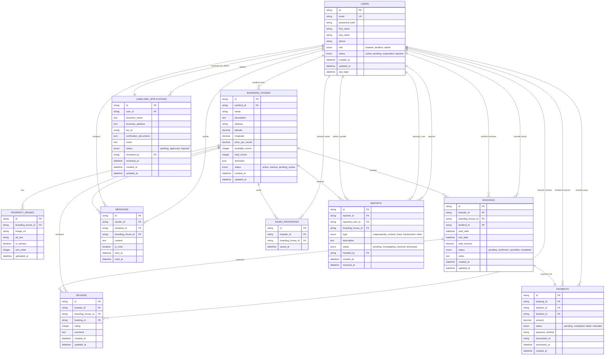

# Boarding House System Flow Diagrams

## User Authentication & Role Flow

## Boarder User Journey

## Landlord User Journey

## Admin Management Flow

## System Architecture Flow

## Entity Relationship Diagram

## Database Schema Notes

### Key Design Decisions:

1. **Single Users Table**: All user types (boarders, landlords, admins) are stored in one table with role and status fields for access control.

2. **Tenant Isolation**: Landlords can only access their own boarding houses through landlord_id foreign keys.

3. **Approval Workflow**: Landlord applications are tracked separately, with status changes reflected in the users table.

4. **Flexible Amenities**: JSON field allows for dynamic amenity lists without schema changes.

5. **Comprehensive Messaging**: Messages are linked to specific properties for context.

6. **Audit Trail**: Created/updated timestamps on all major entities for tracking changes.

7. **Soft Relationships**: Status fields allow for soft deletion and state management without losing data.

### Indexes Recommended:

- `users.email` (unique)
- `users.role, users.status`
- `boarding_houses.landlord_id`
- `boarding_houses.status`
- `bookings.boarder_id, bookings.status`
- `bookings.landlord_id, bookings.status`
- `messages.recipient_id, messages.is_read`
- `saved_properties.boarder_id`