Below is a clean, complete, and practical list of Frontend and Backend languages and their best / most popular frameworks.
This is an industry-oriented overview, not theory.

---

## 🌐 FRONTEND LANGUAGES & FRAMEWORKS

### Core Frontend Languages (Browser)

| Language   | Purpose   | Best / Popular Frameworks |
| ---------- | --------- | ------------------------- |
| HTML       | Structure | — (no framework)          |
| CSS        | Styling   | Tailwind CSS, Bootstrap   |
| JavaScript | Logic     | React, Vue, Angular       |
| TypeScript | Typed JS  | React, Angular, Vue       |

> ⚠️ HTML & CSS don't have "frameworks" in the same sense — JS frameworks sit on top of them

---

### Frontend JavaScript / TypeScript Frameworks

| Framework | Language   | Type           | Best Use             |
| --------- | ---------- | -------------- | -------------------- |
| React     | JS / TS    | Library        | Industry standard UI |
| Angular   | TypeScript | Full framework | Enterprise apps      |
| Vue.js    | JS / TS    | Framework      | Easy & clean UI      |
| Svelte    | JS / TS    | Compiler       | High performance     |
| SolidJS   | TS         | Reactive       | Ultra-fast UI        |

### React Component Libraries

| Library           | Type                | Best Use                                                 | Popularity                                                                           |
| ----------------- | ------------------- | -------------------------------------------------------- | ------------------------------------------------------------------------------------ |
| Material UI (MUI) | Component Library   | Google's Material Design components                      | Most widely adopted (95.1k GitHub stars, 4.1M weekly npm downloads)                  |
| Shadcn/ui         | Component Library   | Accessible, customizable UI components with Tailwind CSS | Rapidly growing, highly favored for Tailwind projects (82.9k GitHub stars)           |
| Ant Design        | Component Library   | Enterprise-level UI components                           | Top choice for enterprise apps (94k GitHub stars, 1.4M weekly npm downloads)         |
| Chakra UI         | Component Library   | Accessible and themeable components                      | Popular for accessible designs (38.7k GitHub stars, 590k weekly npm downloads)       |
| Headless UI       | Headless Components | Unstyled, accessible components                          | Best for custom styling with Tailwind (27k GitHub stars, 2M weekly npm downloads)    |
| Mantine           | Component Library   | Full-featured library with 100+ components               | Developer-friendly with excellent DX (28.1k GitHub stars, 500k weekly npm downloads) |

> **Note**: Material UI remains the most widely adopted React component library overall, but Shadcn/ui has gained significant popularity, especially in projects using Tailwind CSS. Shadcn/ui's unique "copy-and-paste" approach allows developers to own the component code directly, avoiding dependency issues while maintaining design consistency. It's built on Radix UI primitives and Tailwind CSS. Other notable libraries include Mantine, which offers a comprehensive set of components with excellent developer experience.

---

### Frontend Meta / Full-Stack Frameworks

| Framework | Based On | Use Case             |
| --------- | -------- | -------------------- |
| Next.js   | React    | SSR, SEO, full-stack |
| Nuxt.js   | Vue      | SSR, SEO             |
| SvelteKit | Svelte   | Modern full-stack    |
| Remix     | React    | Web fundamentals     |

---

### CSS Frameworks

| Type            | Frameworks             |
| --------------- | ---------------------- |
| Utility-first   | Tailwind CSS ⭐        |
| Component-based | Bootstrap, Material UI |
| Modern          | UnoCSS                 |

---

## 🖥️ BACKEND LANGUAGES & FRAMEWORKS

### JavaScript / TypeScript

| Runtime | Best Frameworks          | Key Strengths                                                                                        |
| ------- | ------------------------ | ---------------------------------------------------------------------------------------------------- |
| Node.js | Express, NestJS, Fastify | Express: Lightweight & flexible; NestJS: Enterprise-grade with TypeScript; Fastify: High-performance |
| Bun     | Elysia ⭐, Hono          | Elysia: Built for Bun runtime; Hono: Minimal & fast                                                  |
| Deno    | Fresh, Oak               | Fresh: Full-stack framework; Oak: Middleware framework                                               |

### Python

| Language | Best Frameworks           | Key Strengths                                                                               |
| -------- | ------------------------- | ------------------------------------------------------------------------------------------- |
| Python   | Django, FastAPI ⭐, Flask | Django: Full-stack with admin; FastAPI: Async & fast API dev; Flask: Lightweight & flexible |

### Java

| Language | Best Frameworks | Key Strengths                                             |
| -------- | --------------- | --------------------------------------------------------- |
| Java     | Spring Boot ⭐  | Enterprise-grade, extensive ecosystem, auto-configuration |

### C#

| Language | Best Frameworks | Key Strengths                                       |
| -------- | --------------- | --------------------------------------------------- |
| C#       | ASP.NET Core ⭐ | Cross-platform, high performance, Microsoft support |

### PHP

| Language | Best Frameworks     | Key Strengths                                                                      |
| -------- | ------------------- | ---------------------------------------------------------------------------------- |
| PHP      | Laravel ⭐, Symfony | Laravel: Elegant syntax & developer-friendly; Symfony: Flexible & enterprise-ready |

### Go (Golang)

| Language | Best Frameworks     | Key Strengths                                                                      |
| -------- | ------------------- | ---------------------------------------------------------------------------------- |
| Go       | Gin ⭐, Fiber, Echo | Gin: HTTP web framework with routing; Fiber: Express-like; Echo: Fast & minimalist |

---

### Ruby

| Language | Best Frameworks  | Key Strengths                                    |
| -------- | ---------------- | ------------------------------------------------ |
| Ruby     | Ruby on Rails ⭐ | Convention over configuration, rapid development |

### Rust

| Language | Best Frameworks        | Key Strengths                                                                |
| -------- | ---------------------- | ---------------------------------------------------------------------------- |
| Rust     | Actix ⭐, Axum, Rocket | Actix: High-performance; Axum: Tokio integration; Rocket: Developer-friendly |

### Kotlin

| Language | Best Frameworks | Key Strengths                                                |
| -------- | --------------- | ------------------------------------------------------------ |
| Kotlin   | Ktor ⭐, Spring | Ktor: Lightweight & async; Spring: Enterprise Java ecosystem |

### Swift

| Language | Best Frameworks | Key Strengths                               |
| -------- | --------------- | ------------------------------------------- |
| Swift    | Vapor ⭐        | Server-side Swift, type-safe, async support |

### Scala

| Language | Best Frameworks | Key Strengths                                  |
| -------- | --------------- | ---------------------------------------------- |
| Scala    | Play Framework  | Reactive, stateless, high-performance web apps |

---

## 📊 QUICK SUMMARY (BEST PICKS)

| Category                    | Stack                                                                                       |
| --------------------------- | ------------------------------------------------------------------------------------------- |
| Most Popular Frontend Stack | TypeScript + React + Tailwind + Next.js                                                     |
| Most Popular Backend Stack  | Node.js + NestJS                                                                            |
| High-Performance Backend    | Go + Gin / Rust + Actix / Bun + Elysia                                                      |
| Beginner Friendly           | Frontend: HTML + CSS + JavaScript + React Backend: Node.js + Express OR Python + FastAPI |

---

## 🧠 ONE-LINE TAKEAWAY

> Frontend = HTML, CSS, JavaScript + frameworks like React.
> Backend = many languages, each with strong frameworks like Spring, Laravel, NestJS.

---

## 🤝 Need More Help?

I can help you with:

- Recommend ONE best stack for you
- Create a learning roadmap
- Compare full-stack combinations
- Explain which language pays more

Just tell me 👍

---

## 🏗️ Technology Organizational Structure

The following diagram illustrates how different technologies fit into various application development areas:

```mermaid
graph TD
    A[Technology Stack] --> B[Frontend Development]
    A --> C[Backend Development]
    A --> D[Mobile Development]
    A --> E[Desktop Applications]

    B --> B1[Web Frontend]
    B --> B2[Mobile Frontend]

    B1 --> B11[HTML/CSS/JS]
    B1 --> B12[React Ecosystem]
    B1 --> B13[Vue Ecosystem]
    B1 --> B14[Angular]
    B1 --> B15[Svelte/SolidJS]

    B12 --> B12a[React]
    B12 --> B12b[Next.js]
    B12 --> B12c[Shadcn/ui]
    B12 --> B12d[Tailwind CSS]

    B13 --> B13a[Vue.js]
    B13 --> B13b[Nuxt.js]

    C --> C1[Backend Runtimes]
    C --> C2[Backend Languages]

    C1 --> C11[Node.js]
    C1 --> C12[Bun]
    C1 --> C13[Deno]

    C2 --> C21[Python]
    C2 --> C22[Java]
    C2 --> C23[C#]
    C2 --> C24[PHP]
    C2 --> C25[Go]
    C2 --> C26[Rust]
    C2 --> C27[Kotlin]
    C2 --> C28[Swift]
    C2 --> C29[Scala]

    C11 --> C11a[Express]
    C11 --> C11b[NestJS]
    C11 --> C11c[Fastify]

    C12 --> C12a[Elysia]
    C12 --> C12b[Hono]

    C21 --> C21a[Django]
    C21 --> C21b[FastAPI]
    C21 --> C21c[Flask]

    C22 --> C22a[Spring Boot]

    C23 --> C23a[ASP.NET Core]

    C24 --> C24a[Laravel]
    C24 --> C24b[Symfony]

    C25 --> C25a[Gin]
    C25 --> C25b[Fiber]
    C25 --> C25c[Echo]

    C26 --> C26a[Actix]
    C26 --> C26b[Axum]
    C26 --> C26c[Rocket]

    D --> D1[iOS Apps]
    D --> D2[Android Apps]
    D --> D3[Cross-Platform]

    D3 --> D31[React Native]
    D3 --> D32[Flutter]
    D3 --> D33[Xamarin]
    D3 --> D34[NativeScript]

    E --> E1[Electron Apps]
    E --> E2[Progressive Web Apps]
    E --> E3[Tauri/Rust Apps]
```

### Use Cases by Application Type

- **Web Applications**: React/Next.js + Node.js/NestJS + PostgreSQL
- **Mobile Applications**: React Native/Flutter with backend APIs
- **Real-time Applications**: Node.js with Socket.io or Go with high concurrency
- **Enterprise Applications**: Java Spring Boot or C# ASP.NET Core
- **High-Performance APIs**: Rust (Actix/Axum) or Go (Gin)
- **Rapid Prototyping**: Python (FastAPI/Django) or Node.js (Express)
- **Microservices**: Go, Rust, or Node.js depending on performance needs
- **Data-Intensive Applications**: Python (Django/FastAPI) with data science libraries
